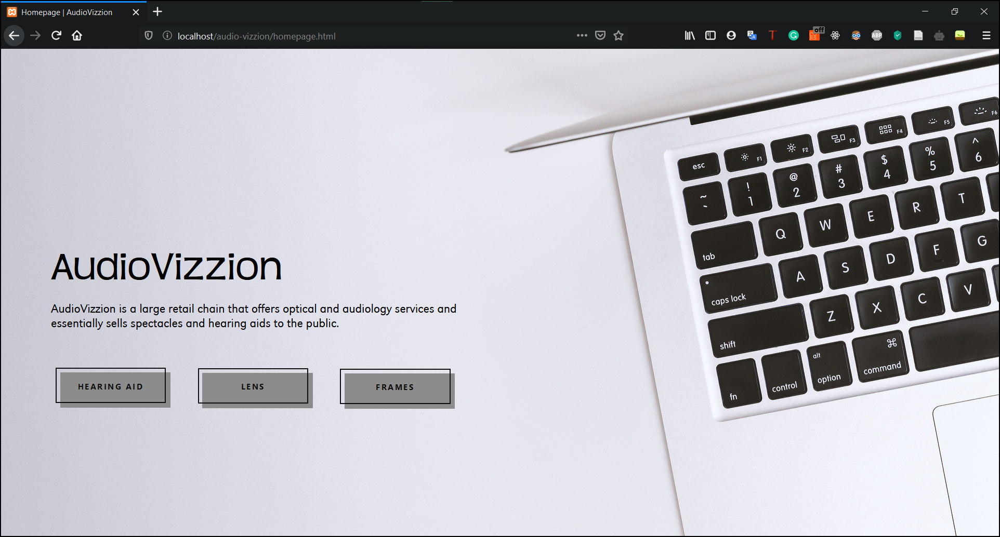
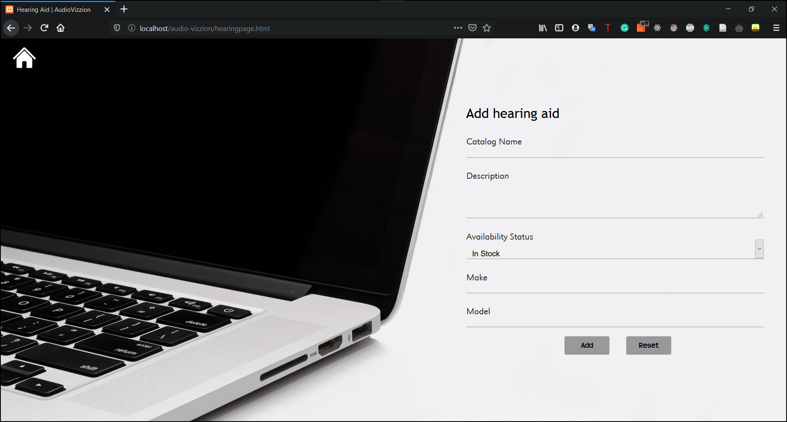
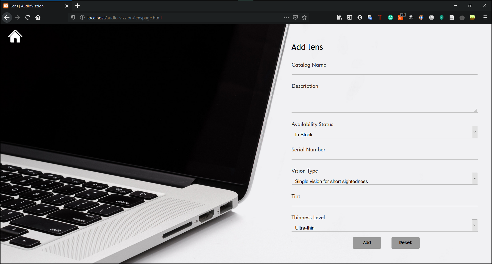

# AudioVizzion
A web application to add products into the database. This application was developed using PHP, MySQLi Procedural, HTML and CSS.

## Table of Contents
- [Getting Started](#getting-started)
- [Screenshots](#screenshots)
- [Built With](#built-with)
- [Authors](#authors)
- [License](#license)

## Getting Started

These instructions will get you a copy of the project up and running on your local machine for development and testing purposes.

### Prerequisites

* [XAMPP](https://www.apachefriends.org/download.html)
* [MySQL](https://www.mysql.com/downloads/)
* [Apache](https://httpd.apache.org/download.cgi)

### Installation

#### Clone Repository:
  
    git clone https://github.com/shiromi-basil/audio-vizzion.git

#### Setup database:

Type `localhost/phpmyadmin/` in the browser's address bar. Click on the 'Import' tab in the navigation menu. Upload the file `audio-vizzion/audio-vizzion.sql` to setup datebase and add demo data into the database.

#### Visit application:

Move the project folder to `C:\xampp\htdocs`. Start Apache and SQL in the XAMPP server. Type `localhost/ audio-vizzion/homepage.html` in the browser's address bar.

## Screenshots

## Built With
* [HTML](https://www.w3.org/html/)
* [PHP](https://www.php.net/docs.php)
* [CSS](https://www.w3.org/Style/CSS/Overview.en.html)
* [MySQL](https://dev.mysql.com/doc/)

## Authors
* Shiromi Basil - [shiromi-basil](https://github.com/shiromi-basil)

See also the list of [contributors](https://github.com/shiromi-basil/audio-vizzion/graphs/contributors) who participated in this project.

## License
This project is licensed under the MIT License - see the [LICENSE](LICENSE) file for details.
